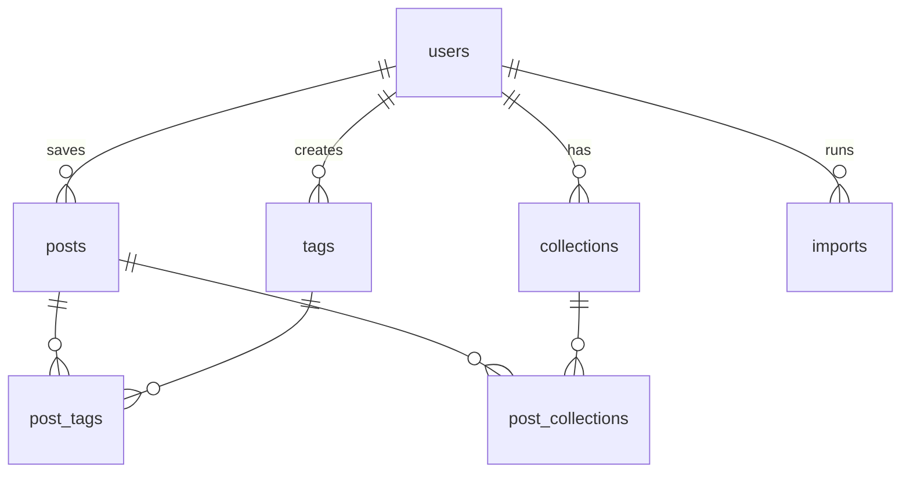

# Reelbox

A web app for people who save lots of reels for inspiration. Upload your official Instagram data export, then tag, filter and find your saves.

Work in progress.

## Stack

Next.js (App Router) and TypeScript, Postgres on Neon with Prisma, Zod, Sass modules, Vitest and Playwright. Hosted on Vercel.

## Getting started

Requires Node 24.

```bash
npm install                # also generates the Prisma client
cp .env.example .env       # then fill in the database URLs
npm run db:migrate         # apply migrations to your development database
npm run dev                # http://localhost:3000
```

Use a separate development database (for example a Neon branch), not production.

## Scripts

| Script                                | What it does                                                                         |
| ------------------------------------- | ------------------------------------------------------------------------------------ |
| `npm run dev`                         | Start the development server                                                         |
| `npm run build`                       | Production build                                                                     |
| `npm run lint`                        | ESLint                                                                               |
| `npm run format`                      | Format with Prettier                                                                 |
| `npm run typecheck`                   | Type-check the project                                                               |
| `npm test`                            | Run the unit tests (Vitest)                                                          |
| `npm run db:migrate -- --name <name>` | Create and apply a migration on the development database, then regenerate the client |
| `npm run db:deploy`                   | Apply pending migrations without resetting anything                                  |
| `npm run db:studio`                   | Browse the database in Prisma Studio                                                 |

## Deployment

Vercel deploys every branch as a preview and `main` to production. Production builds apply pending database migrations before building (`npm run build:vercel`, set in `vercel.json`), so the database is updated before the new code goes live. Preview builds skip migrations.

Functions run in Frankfurt (`fra1`, set in `vercel.json`), the same region as the Neon database. Vercel's default is Washington D.C. (`iad1`), where every query would cross the Atlantic (~90 ms per round trip). The `x-vercel-id` response header shows the region a request ran in.

Environment variables in Vercel (see `.env.example` for what each one is):

| Variable                      | Production                                   | Preview                              |
| ----------------------------- | -------------------------------------------- | ------------------------------------ |
| `DATABASE_URL`                | Production database, pooled                  | Development database, pooled         |
| `DATABASE_URL_UNPOOLED`       | Production database, direct (for migrations) | Not needed                           |
| `BETTER_AUTH_SECRET`          | Its own secret                               | A different secret                   |
| `BETTER_AUTH_URL`             | The production URL                           | The production URL (only a fallback) |
| `BREVO_API_KEY`, `EMAIL_FROM` | Brevo key and verified sender                | Same                                 |

Preview URLs change with every deployment. Sign-in follows the URL the request came in on, as long as it matches the allowed hosts in `lib/auth.ts`.

## Database

Every table belongs to a user, and deleting a user deletes all their data.



| Table              | Purpose                                                                             | Key constraint                                                       |
| ------------------ | ----------------------------------------------------------------------------------- | -------------------------------------------------------------------- |
| `users`            | Account; demo visitors are temporary users (`is_anonymous`), deleted after 24 hours | Unique `email`                                                       |
| `posts`            | A saved post or reel: shortcode, URL, caption, creator, hashtags, saved date        | Unique `(user_id, shortcode)`                                        |
| `collections`      | Collections from the export                                                         | Unique `(user_id, external_id)`                                      |
| `post_collections` | Which posts are in which collections                                                | Primary key `(post_id, collection_id)`                               |
| `tags`             | The user's own tags                                                                 | Unique `(user_id, name_key)`, so "Recipes" and "recipes" are one tag |
| `post_tags`        | Which tags are on which posts                                                       | Primary key `(post_id, tag_id)`                                      |
| `imports`          | One row per upload: date range covered and new / duplicate / invalid counts         | —                                                                    |

The schema lives in `prisma/schema.prisma`; migrations are in `prisma/migrations/`.

## License

MIT
